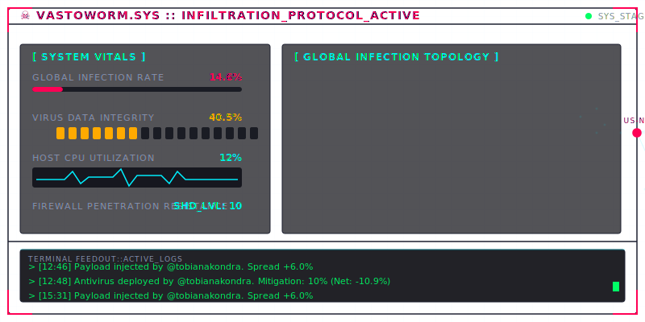

# VastoWorm.sys ☠️

Welcome to my profile. The system has been compromised. An autonomous cyber-virus Tamagotchi is replicating in the background.

<!-- VASTOWORM:START -->

<p align="center">
  
</p>

```text
========================================================================
[VASTOWORM.SYS RECON TERMINAL] - LAST UPDATE: Wed, 24 Jun 2026 23:59:28 GMT
========================================================================
▶ EVOLUTION STAGE         : MUTATING
▶ GLOBAL INFECTION RATE   : 17.1%
▶ CORE CODE INTEGRITY     : 10.0%
▶ HOST CPU LOAD           : 12%
▶ SHIELD STRENGTH         : 10 (increases with repo stars ⭐️)

[LOG STREAM]
> [12:46] Payload injected by @tobianakondra. Spread +6.0%
> [12:48] Antivirus deployed by @tobianakondra. Mitigation: 10% (Net: -10.9%)
> [15:31] Payload injected by @tobianakondra. Spread +6.0%
> [19:26] WARNING: Core integrity under 40%.
> [17:40] Replication cycle: +12% integrity, +2.5% spread.
========================================================================
```

<p align="center">
  <a href="https://github.com/tobianakondra/tobianakondra/issues/new?title=VASTO-WORM%3A+INJECT_PAYLOAD&body=Clicking+%27Submit+new+issue%27+will+transmit+a+malicious+viral+payload+to+VastoWorm.sys+and+accelerate+the+global+infection+rate.%0A%0A%5BDO+NOT+MODIFY+THE+ISSUE+TITLE%5D">
    
  </a>
  &nbsp;&nbsp;&nbsp;&nbsp;
  <a href="https://github.com/tobianakondra/tobianakondra/issues/new?title=VASTO-WORM%3A+DEPLOY_ANTIVIRUS&body=Clicking+%27Submit+new+issue%27+will+deploy+an+antivirus+cyber-patch+to+quarantine+VastoWorm.sys.+The+effectiveness+of+this+patch+depends+on+the+virus%27s+current+Shield+Resistance.%0A%0A%5BDO+NOT+MODIFY+THE+ISSUE+TITLE%5D">
    
  </a>
  &nbsp;&nbsp;&nbsp;&nbsp;
  <a href="https://github.com/tobianakondra/tobianakondra/issues/new?title=VASTO-WORM%3A+TRIGGER_MUTATION&body=Clicking+%27Submit+new+issue%27+will+initiate+a+radiation+mutation+sequence+in+the+virus%27s+genetic+code.+The+outcome+is+highly+unpredictable.%0A%0A%5BDO+NOT+MODIFY+THE+ISSUE+TITLE%5D">
    
  </a>
</p>
<p align="center">
  <sub>Clicking the actions above will redirect you to open a pre-formatted GitHub issue. The VastoWorm automation will parse your ticket, evolve the state, and close the issue automatically.</sub>
</p>

<!-- VASTOWORM:END -->

---
Created and evolved autonomously via GitHub Actions.
